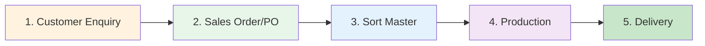
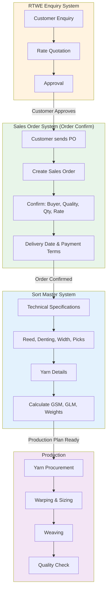

# Sales Order Business Flow Explained

## The Correct Sequence: Enquiry → Sales Order → Sort Master

In a textile manufacturing business, here's the **correct flow**:



---

## Detailed Business Flow

### **Stage 1: Customer Enquiry** 📋
**What happens:**
- Customer asks for a quote
- You provide rate, quality details
- Customer reviews and negotiates

**Your System:** ✅ You have this (RTWE Enquiry System)
- Pending Enquiries
- Pending Approved
- Rate given to customer

---

### **Stage 2: Sales Order (Order Confirmation)** 📝
**What happens:**
- Customer confirms they want to buy
- They send **Purchase Order (PO)**
- You create **Sales Order (SO)** in your system
- You confirm: Buyer, Quality, Quantity, Rate, Delivery Date, Payment Terms

**Your System:** ✅ You have this (Order Confirm Data)
- Order Confirm Form
- Buyer, PO No, Quality Order
- Design & TAGA (quantity)
- Final Rate, Payment Terms, Delivery Date

**This is the COMMERCIAL/SALES document** - it's about WHAT to produce and WHEN

---

### **Stage 3: Sort Master** 🧵
**What happens:**
- Production team takes the Sales Order
- Creates **technical specifications** for manufacturing
- Defines: Reed, Denting, Width, Picks, Yarn details
- Calculates: Total Ends, GSM, GLM, Warp/Weft weights

**Your System:** ✅ You have this (Sort Master System 2026)
- Sort Master Form
- Technical calculations
- Production specifications

**This is the TECHNICAL/PRODUCTION document** - it's about HOW to produce

---

## Visual Flow with Your Systems



---

## Why This Order Matters

### ❌ **WRONG: Sort Master Before Sales Order**
```
Customer Enquiry → Sort Master → Sales Order
```
**Problem:** You're creating technical specs BEFORE the customer confirms the order!

### ✅ **CORRECT: Sales Order Before Sort Master**
```
Customer Enquiry → Sales Order → Sort Master
```
**Why:** 
1. Customer confirms order (Sales Order)
2. THEN you create production plan (Sort Master)
3. You don't waste time on technical specs for orders that might not happen

---

## What Each System Contains

### **Sales Order (Order Confirm)** - COMMERCIAL
| Field | Purpose |
|-------|---------|
| PO Number | Customer's purchase order reference |
| Buyer Name | Who is buying |
| Quality Order | What fabric quality |
| Design 1-6 | Different designs in the order |
| TAGA 1-6 | Quantity for each design (in meters/pieces) |
| Final Rate | Price per unit |
| Payment Terms | When customer pays |
| Delivery Date | When to deliver |
| Total Order Value | Total money |

**Focus:** BUSINESS - What, When, How Much

---

### **Sort Master** - TECHNICAL
| Field | Purpose |
|-------|---------|
| Reed | Technical specification |
| Denting | Ends per dent |
| Width | Fabric width |
| Picks | Weft density |
| Warp Details | Yarn count, pattern, weight |
| Weft Details | Yarn count, pattern, weight |
| GSM | Grams per square meter |
| GLM | Grams per linear meter |
| Total Ends | Total warp threads |

**Focus:** PRODUCTION - How to make it

---

## Integration: How They Should Work Together

```mermaid
flowchart TD
    SO[Sales Order Created<br/>RTWE-2026-001]
    
    SO --> Check{Sort Master<br/>Exists?}
    
    Check -->|No| Create[Create Sort Master Button]
    Create --> AutoFill[Auto-fill from Sales Order:<br/>- Quality<br/>- Customer<br/>- Order Qty]
    AutoFill --> TechDetails[Production team fills<br/>technical details]
    
    Check -->|Yes| Link[Link to existing<br/>Sort Master]
    
    TechDetails --> SM[(Sort Master<br/>SM-2026-001)]
    Link --> SM
    
    SM --> Status[Show Status in<br/>Sales Order:<br/>"In Production"]
    
    style SO fill:#e8f5e9
    style SM fill:#e3f2fd
    style Create fill:#fff3e0
```

---

## Recommended Integration

### **In Sales Order System, Add:**

1. **"Create Sort Master" Button**
   - Automatically creates Sort Master from Sales Order
   - Pre-fills: Quality, Customer, Order Quantity
   - Production team completes technical details

2. **"Link to Sort Master" Field**
   - Shows which Sort Master is linked
   - Click to view Sort Master details

3. **"Production Status" Display**
   - Shows if Sort Master created
   - Shows production progress

### **In Sort Master System, Add:**

1. **"Sales Order Reference" Field**
   - Links back to original Sales Order
   - Shows PO Number, Buyer, Delivery Date

2. **"Order Quantity" Display**
   - Shows total quantity from Sales Order
   - Helps calculate yarn requirements

---

## Example Flow

### **Real-World Example:**

**Day 1:** Customer "ABC Textiles" enquires about 100% Cotton fabric
- **System:** RTWE Enquiry
- **Action:** Create enquiry, give rate

**Day 3:** Customer approves rate, sends PO
- **System:** Sales Order (Order Confirm)
- **Action:** Create Sales Order
  - PO: ABC-PO-2026-001
  - Quality: 100% Cotton 60x60
  - Quantity: 5000 meters
  - Rate: ₹150/meter
  - Delivery: 30 days
  - Total Value: ₹7,50,000

**Day 4:** Production team receives Sales Order
- **System:** Sort Master
- **Action:** Create Sort Master from Sales Order
  - Auto-filled: Quality, Customer, Quantity
  - Production fills: Reed 64, Denting 2, Width 64"
  - Calculates: GSM, GLM, Yarn requirements

**Day 5-35:** Production happens
- Yarn procurement
- Warping, Sizing, Weaving
- Quality check

**Day 35:** Delivery to customer

---

## Summary

### **The Correct Sequence:**
```
1. Enquiry (Quote) 
   ↓
2. Sales Order (Customer confirms with PO)
   ↓
3. Sort Master (Production specifications)
   ↓
4. Production
   ↓
5. Delivery
```

### **Your Current Systems:**
- ✅ Enquiry System (RTWE Enquiry)
- ✅ Sales Order (Order Confirm Data)
- ✅ Sort Master (Sort Master System 2026)

### **What's Missing:**
- ❌ Link between Sales Order and Sort Master
- ❌ "Create Sort Master" button in Sales Order
- ❌ Production status tracking

### **Next Step:**
Focus on **Sales Order** first, then link it to Sort Master for seamless workflow!
