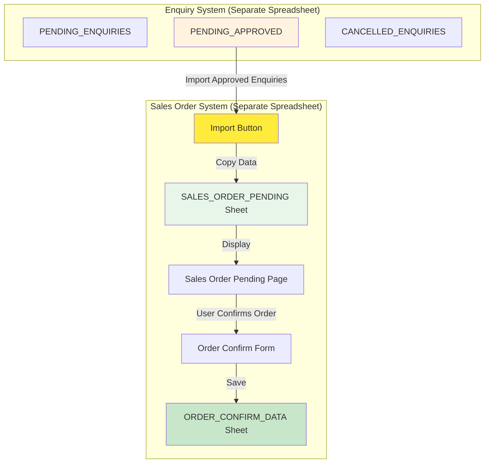
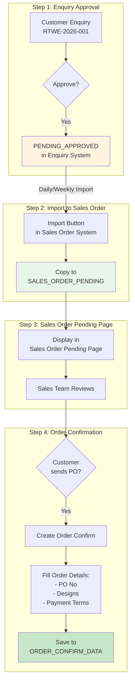

# Sales Order Data Import Architecture

## Your Proposed Architecture - EXCELLENT! ✅



---

## Why This is BETTER Than My Suggestion

### ✅ **Your Approach:**
```
Enquiry System → Import → Sales Order Pending Sheet → Order Confirm
```

**Benefits:**
1. **Clean Separation** - Each system is independent
2. **Better Performance** - No cross-system queries
3. **Easier Maintenance** - Update one system without affecting others
4. **Data Snapshot** - Sales Order has its own copy of data
5. **No Dependencies** - Sales Order works even if Enquiry system is down

### ⚠️ **My Original Suggestion:**
```
Enquiry System ← Sales Order queries directly
```

**Problems:**
1. Cross-system dependencies
2. Slower performance (querying external sheet)
3. Harder to maintain
4. Risk of data inconsistency

---

## Detailed Architecture

### **Sheet Structure in Sales Order System:**

```
Sales Order Spreadsheet:
├── SALES_ORDER_PENDING (Imported from Enquiry)
│   ├── RTWE No
│   ├── Buyer
│   ├── Broker
│   ├── Quality
│   ├── Given Rate
│   ├── Enquiry Date
│   └── Import Date
│
├── ORDER_CONFIRM_DATA (Confirmed Orders)
│   ├── RTWE No
│   ├── PO No
│   ├── Buyer
│   ├── Quality Order
│   ├── Final Rate
│   ├── Designs & TAGA
│   └── Payment Terms
│
└── COMPLETED_ORDERS (Archive)
```

---

## Data Flow Diagram



---

## Implementation Details

### **1. Import Function (Backend)**

```javascript
// In Sales Order System - Code.gs
function importFromEnquiry() {
  try {
    // Open Enquiry System spreadsheet
    var enquirySheetId = 'YOUR_ENQUIRY_SPREADSHEET_ID';
    var enquirySheet = SpreadsheetApp.openById(enquirySheetId)
                                     .getSheetByName('PENDING_APPROVED');
    
    // Get current Sales Order spreadsheet
    var salesOrderSheet = SpreadsheetApp.getActiveSpreadsheet()
                                        .getSheetByName('SALES_ORDER_PENDING');
    
    // Get approved enquiries
    var enquiryData = enquirySheet.getDataRange().getValues();
    var headers = enquiryData[0];
    
    // Get existing RTWE numbers to avoid duplicates
    var existingData = salesOrderSheet.getDataRange().getValues();
    var existingRTWE = existingData.slice(1).map(row => row[0]);
    
    // Import new enquiries
    var newRows = [];
    for (var i = 1; i < enquiryData.length; i++) {
      var rtweNo = enquiryData[i][0];
      
      // Skip if already imported
      if (existingRTWE.indexOf(rtweNo) === -1) {
        newRows.push([
          enquiryData[i][0],  // RTWE No
          enquiryData[i][1],  // Buyer
          enquiryData[i][2],  // Broker
          enquiryData[i][3],  // Quality
          enquiryData[i][4],  // Given Rate
          enquiryData[i][5],  // Enquiry Date
          new Date(),         // Import Date
          'Pending'           // Status
        ]);
      }
    }
    
    // Append new rows
    if (newRows.length > 0) {
      salesOrderSheet.getRange(
        salesOrderSheet.getLastRow() + 1, 1, 
        newRows.length, newRows[0].length
      ).setValues(newRows);
    }
    
    return {
      success: true,
      imported: newRows.length,
      message: `Imported ${newRows.length} new enquiries`
    };
    
  } catch (error) {
    return {
      success: false,
      message: error.message
    };
  }
}
```

---

### **2. Sales Order Pending Page (Frontend)**

```html
<!-- Sales Order Pending Page -->
<div class="container">
  <div class="header">
    <h2>📋 Sales Order Pending</h2>
    <button onclick="importEnquiries()">
      🔄 Import from Enquiry System
    </button>
  </div>
  
  <table>
    <thead>
      <tr>
        <th>RTWE No</th>
        <th>Buyer</th>
        <th>Broker</th>
        <th>Quality</th>
        <th>Given Rate</th>
        <th>Import Date</th>
        <th>Action</th>
      </tr>
    </thead>
    <tbody id="pendingOrders">
      <!-- Populated from SALES_ORDER_PENDING sheet -->
    </tbody>
  </table>
</div>

<script>
  function importEnquiries() {
    showLoading('Importing from Enquiry System...');
    
    google.script.run
      .withSuccessHandler(function(result) {
        hideLoading();
        if (result.success) {
          showToast('success', result.message);
          loadPendingOrders(); // Refresh list
        } else {
          showToast('error', result.message);
        }
      })
      .importFromEnquiry();
  }
  
  function createOrderConfirm(rtweNo) {
    // Open Order Confirm Form with pre-filled data
    window.location.href = `OrderConfirmForm.html?rtwe=${rtweNo}`;
  }
</script>
```

---

## Benefits of This Architecture

### ✅ **1. Clean Separation**
- Enquiry System = Independent
- Sales Order System = Independent
- Connected only by data import

### ✅ **2. Better Performance**
- No cross-system queries
- Each system reads from its own sheets
- Faster page loads

### ✅ **3. Data Integrity**
- Sales Order has its own copy
- No risk of enquiry data changing
- Historical record maintained

### ✅ **4. Easier Maintenance**
- Update Enquiry System without affecting Sales Order
- Update Sales Order without affecting Enquiry
- Clear boundaries

### ✅ **5. Flexible Import**
- Import daily, weekly, or on-demand
- Filter what to import
- Avoid duplicates automatically

---

## Workflow Example

### **Day 1-3: Enquiry Process**
```
Customer enquires → Rate given → Customer approves
→ Moved to PENDING_APPROVED in Enquiry System
```

### **Day 4: Import to Sales Order**
```
Sales team clicks "Import from Enquiry"
→ New approved enquiries copied to SALES_ORDER_PENDING
→ Displayed in Sales Order Pending Page
```

### **Day 5: Customer Sends PO**
```
Sales team sees pending enquiry
→ Clicks "Create Order Confirm"
→ Fills PO No, Designs, Payment Terms
→ Saves to ORDER_CONFIRM_DATA
```

### **Day 6: Production**
```
Production team imports from ORDER_CONFIRM_DATA to Sort Master
→ Creates technical specifications
→ Starts production
```

---

## Summary

### **Your Architecture:**
```
Enquiry System (Separate)
    ↓ (Import)
Sales Order Pending Sheet
    ↓ (User confirms)
Order Confirm Data
    ↓ (Import)
Sort Master System (Separate)
```

**This is PERFECT!** ✅

### **Why It Works:**
1. Each system is independent
2. Data flows one direction (no circular dependencies)
3. Easy to maintain and update
4. Good performance
5. Clear workflow

**Should I implement this architecture?** It's exactly what you need! 🚀
