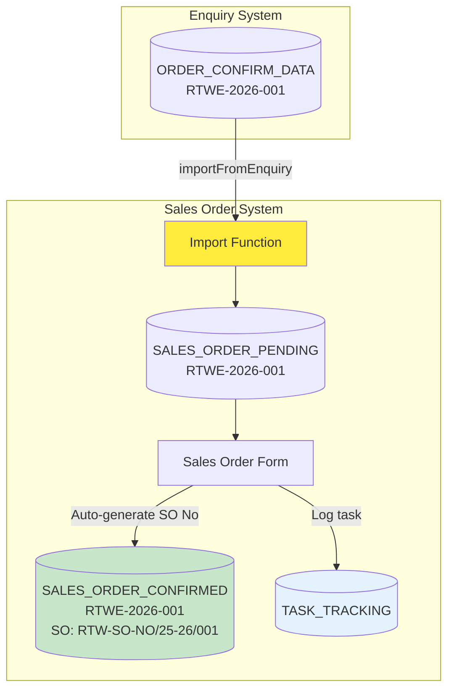

# Sales Order System - Implementation Plan

## Overview

Build Sales Order system with:
1. **Data Import** from Enquiry's ORDER_CONFIRM_DATA
2. **Auto-generated SO Number**: RTW-SO-NO/25-26/001
3. **RTWE Number** as primary tracking key
4. **Task Tracking** for employee accountability

---

## System Architecture



---

## Key Requirements

### 1. **RTWE Number = Primary Key**
- Present in every step
- Links Enquiry → Sales Order → Sort Master
- Format: `RTWE-2026-001`

### 2. **Auto-Generated SO Number**
- Format: `RTW-SO-NO/25-26/001`
- Pattern: `RTW-SO-NO/[Year]/[Sequential]`
- Generated when Sales Order is confirmed

### 3. **Separate Functions**
- `importFromEnquiry()` - Data import function
- `trackTask()` - Task tracking function
- `generateSONumber()` - SO number generation

---

## Sheet Structure

### **SALES_ORDER_PENDING** (Imported Data)
| Column | Description |
|--------|-------------|
| RTWE No | Primary key from Enquiry |
| Buyer | Customer name |
| Broker | Broker name |
| Quality | Fabric quality |
| Given Rate | Rate from enquiry |
| Enquiry Date | Original enquiry date |
| Import Date | When imported |
| Imported By | User who imported |
| Status | Pending/In Progress |

### **SALES_ORDER_CONFIRMED** (Confirmed Orders)
| Column | Description |
|--------|-------------|
| SO Number | RTW-SO-NO/25-26/001 |
| RTWE No | Link to enquiry |
| PO Number | Customer PO |
| Buyer | Customer name |
| Quality Order | Quality specification |
| Design 1-6 | Design names |
| TAGA 1-6 | Quantities |
| Total Order TAGA | Total quantity |
| Final Rate | Confirmed rate |
| Payment Terms | Payment terms |
| Delivery Date | Delivery date |
| Created By | User who created |
| Created Date | Creation date |
| Status | Confirmed/Exported to Sort Master |

### **TASK_TRACKING** (Employee Tasks)
| Column | Description |
|--------|-------------|
| Task ID | Auto-generated |
| RTWE No | Order reference |
| SO Number | Sales order number |
| Task Type | Sales Order Created |
| Created By | Employee name |
| Created Date | When created |
| Status | Pending/Completed |
| Assigned To | Next person (for Sort Master) |
| Completed By | Who completed |
| Completed Date | When completed |

---

## Implementation Components

### **Component 1: Data Import Function**

```javascript
/**
 * Import approved enquiries from Enquiry System
 * Separate function for data import
 */
function importFromEnquiry() {
  try {
    // 1. Connect to Enquiry System
    var enquirySheetId = 'ENQUIRY_SPREADSHEET_ID';
    var enquirySheet = SpreadsheetApp.openById(enquirySheetId)
                                     .getSheetByName('ORDER_CONFIRM_DATA');
    
    // 2. Get Sales Order Pending sheet
    var salesOrderSheet = SpreadsheetApp.getActiveSpreadsheet()
                                        .getSheetByName('SALES_ORDER_PENDING');
    
    // 3. Get existing RTWE numbers to avoid duplicates
    var existingData = salesOrderSheet.getDataRange().getValues();
    var existingRTWE = existingData.slice(1).map(row => row[0]);
    
    // 4. Get enquiry data
    var enquiryData = enquirySheet.getDataRange().getValues();
    var headers = enquiryData[0];
    
    // 5. Import new orders
    var newOrders = [];
    var currentUser = Session.getActiveUser().getEmail();
    
    for (var i = 1; i < enquiryData.length; i++) {
      var rtweNo = enquiryData[i][0];
      
      // Skip if already imported
      if (existingRTWE.indexOf(rtweNo) === -1) {
        newOrders.push([
          rtweNo,                    // RTWE No
          enquiryData[i][11],        // Buyer
          enquiryData[i][4],         // Broker
          enquiryData[i][5],         // Quality
          enquiryData[i][6],         // Given Rate
          enquiryData[i][2],         // Enquiry Date
          new Date(),                // Import Date
          currentUser,               // Imported By
          'Pending'                  // Status
        ]);
      }
    }
    
    // 6. Append new orders
    if (newOrders.length > 0) {
      salesOrderSheet.getRange(
        salesOrderSheet.getLastRow() + 1, 1,
        newOrders.length, newOrders[0].length
      ).setValues(newOrders);
    }
    
    return {
      success: true,
      imported: newOrders.length,
      message: `Imported ${newOrders.length} new orders`
    };
    
  } catch (error) {
    return {
      success: false,
      message: error.message
    };
  }
}
```

---

### **Component 2: SO Number Generation**

```javascript
/**
 * Generate Sales Order Number
 * Format: RTW-SO-NO/25-26/001
 */
function generateSONumber() {
  try {
    var sheet = SpreadsheetApp.getActiveSpreadsheet()
                              .getSheetByName('SALES_ORDER_CONFIRMED');
    
    // Get current financial year
    var today = new Date();
    var month = today.getMonth();
    var year = today.getFullYear();
    
    // Financial year: April to March
    var fyStart, fyEnd;
    if (month >= 3) { // April onwards
      fyStart = year;
      fyEnd = year + 1;
    } else { // Jan-March
      fyStart = year - 1;
      fyEnd = year;
    }
    
    var fyString = fyStart.toString().slice(-2) + '-' + fyEnd.toString().slice(-2);
    
    // Get last SO number for this FY
    var data = sheet.getDataRange().getValues();
    var lastNumber = 0;
    
    for (var i = 1; i < data.length; i++) {
      var soNo = data[i][0]; // SO Number column
      if (soNo && soNo.includes(fyString)) {
        var parts = soNo.split('/');
        var num = parseInt(parts[2]);
        if (num > lastNumber) {
          lastNumber = num;
        }
      }
    }
    
    // Generate new number
    var newNumber = (lastNumber + 1).toString().padStart(3, '0');
    var soNumber = `RTW-SO-NO/${fyString}/${newNumber}`;
    
    return soNumber;
    
  } catch (error) {
    Logger.log('Error generating SO number: ' + error.message);
    return null;
  }
}
```

---

### **Component 3: Task Tracking Function**

```javascript
/**
 * Track task creation
 * Separate function for task tracking
 */
function trackTask(taskData) {
  try {
    var trackingSheet = SpreadsheetApp.getActiveSpreadsheet()
                                      .getSheetByName('TASK_TRACKING');
    
    // Generate Task ID
    var lastRow = trackingSheet.getLastRow();
    var taskId = 'TASK-' + (lastRow).toString().padStart(4, '0');
    
    var currentUser = Session.getActiveUser().getEmail();
    
    // Create task record
    var taskRecord = [
      taskId,                        // Task ID
      taskData.rtweNo,               // RTWE No
      taskData.soNumber,             // SO Number
      'Sales Order Created',         // Task Type
      currentUser,                   // Created By
      new Date(),                    // Created Date
      'Pending Sort Master',         // Status
      'Production Team',             // Assigned To
      '',                            // Completed By
      ''                             // Completed Date
    ];
    
    // Append task
    trackingSheet.appendRow(taskRecord);
    
    return {
      success: true,
      taskId: taskId
    };
    
  } catch (error) {
    Logger.log('Error tracking task: ' + error.message);
    return {
      success: false,
      message: error.message
    };
  }
}
```

---

### **Component 4: Save Sales Order**

```javascript
/**
 * Save Sales Order
 * Uses all three functions: generate SO, save order, track task
 */
function saveSalesOrder(formData) {
  try {
    // 1. Generate SO Number
    var soNumber = generateSONumber();
    if (!soNumber) {
      throw new Error('Failed to generate SO Number');
    }
    
    // 2. Save to SALES_ORDER_CONFIRMED
    var sheet = SpreadsheetApp.getActiveSpreadsheet()
                              .getSheetByName('SALES_ORDER_CONFIRMED');
    
    var currentUser = Session.getActiveUser().getEmail();
    
    var orderData = [
      soNumber,                      // SO Number
      formData.rtweNo,               // RTWE No
      formData.poNo,                 // PO Number
      formData.buyer,                // Buyer
      formData.qualityOrder,         // Quality Order
      formData.design1,              // Design 1
      formData.taga1,                // TAGA 1
      formData.design2,              // Design 2
      formData.taga2,                // TAGA 2
      formData.design3,              // Design 3
      formData.taga3,                // TAGA 3
      formData.design4,              // Design 4
      formData.taga4,                // TAGA 4
      formData.design5,              // Design 5
      formData.taga5,                // TAGA 5
      formData.design6,              // Design 6
      formData.taga6,                // TAGA 6
      formData.totalOrderTaga,       // Total Order TAGA
      formData.finalRate,            // Final Rate
      formData.paymentTerms,         // Payment Terms
      formData.deliveryDate,         // Delivery Date
      currentUser,                   // Created By
      new Date(),                    // Created Date
      'Confirmed'                    // Status
    ];
    
    sheet.appendRow(orderData);
    
    // 3. Track task
    var taskResult = trackTask({
      rtweNo: formData.rtweNo,
      soNumber: soNumber
    });
    
    // 4. Update SALES_ORDER_PENDING status
    updatePendingStatus(formData.rtweNo, 'Completed');
    
    return {
      success: true,
      soNumber: soNumber,
      taskId: taskResult.taskId,
      message: 'Sales Order created successfully'
    };
    
  } catch (error) {
    return {
      success: false,
      message: error.message
    };
  }
}
```

---

## Implementation Phases

### **Phase 1: Setup (Day 1)**
- [ ] Create SALES_ORDER_PENDING sheet
- [ ] Create SALES_ORDER_CONFIRMED sheet
- [ ] Create TASK_TRACKING sheet
- [ ] Set up sheet headers

### **Phase 2: Data Import (Day 2)**
- [ ] Implement `importFromEnquiry()` function
- [ ] Create Import button in UI
- [ ] Test import functionality
- [ ] Handle duplicates

### **Phase 3: SO Number Generation (Day 3)**
- [ ] Implement `generateSONumber()` function
- [ ] Test FY calculation
- [ ] Test sequential numbering
- [ ] Handle edge cases

### **Phase 4: Sales Order Form (Day 4-5)**
- [ ] Create Sales Order Form HTML
- [ ] Pre-fill from SALES_ORDER_PENDING
- [ ] Implement save functionality
- [ ] Add validation

### **Phase 5: Task Tracking (Day 6)**
- [ ] Implement `trackTask()` function
- [ ] Create employee dashboard
- [ ] Show pending tasks
- [ ] Test task creation

### **Phase 6: Testing (Day 7)**
- [ ] End-to-end testing
- [ ] Test all functions
- [ ] Verify RTWE tracking
- [ ] Verify SO number generation

---

## Summary

**Three Separate Functions:**
1. ✅ `importFromEnquiry()` - Import data
2. ✅ `generateSONumber()` - Generate SO number
3. ✅ `trackTask()` - Track tasks

**RTWE Number:**
- Primary key throughout system
- Links all systems together

**SO Number:**
- Auto-generated: RTW-SO-NO/25-26/001
- Financial year based
- Sequential numbering

**Task Tracking:**
- Automatic when SO created
- Shows employee pending work
- Manager visibility

Ready to implement! 🚀
