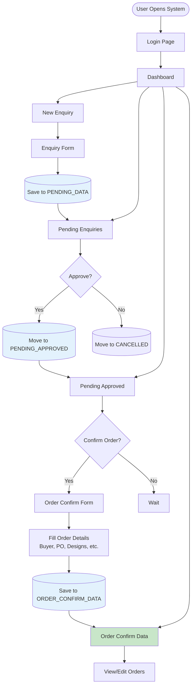
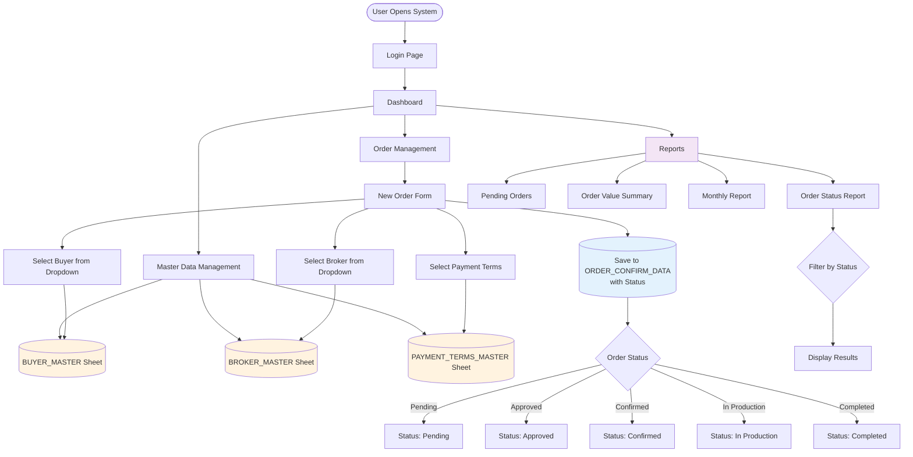
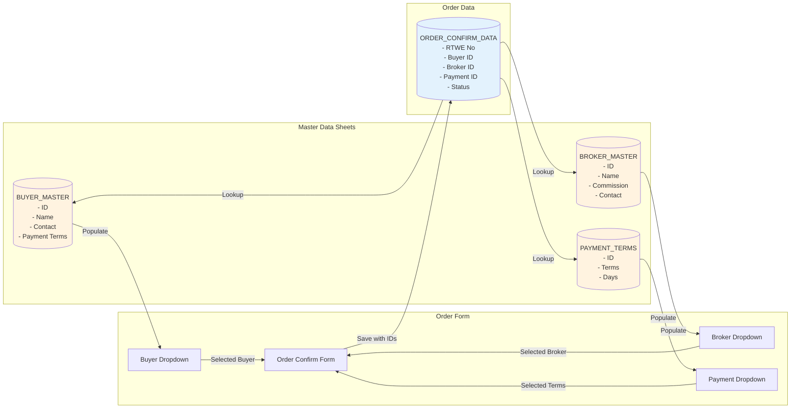
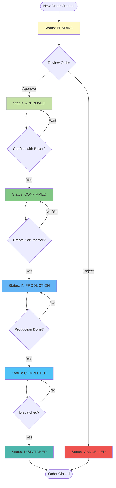
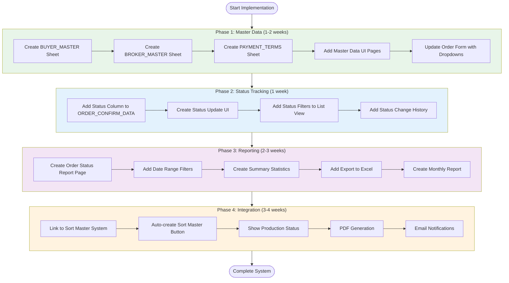
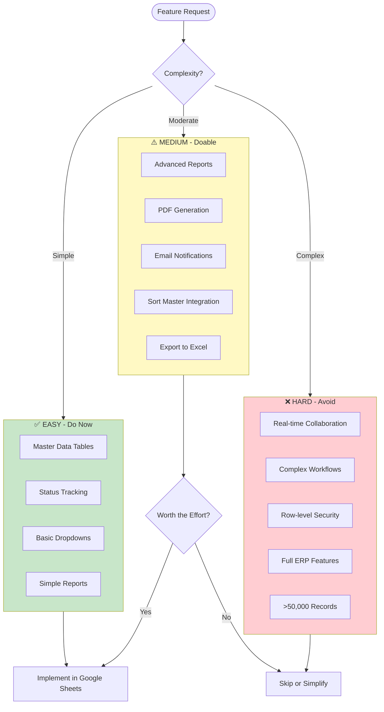
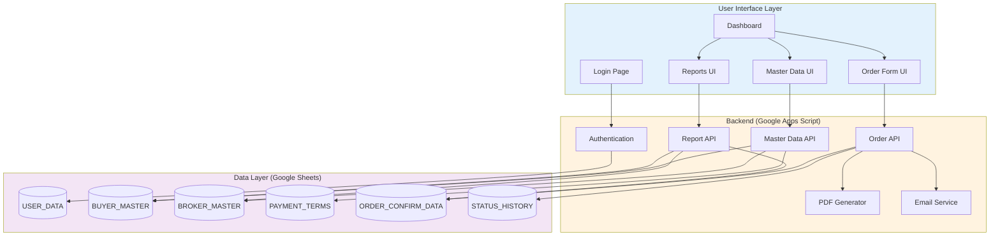

# Sales Order System - Visual Flowcharts

## 1. Current System Architecture

---

## 2. Proposed System with Master Data

---

## 3. Data Flow: Master Data Integration

---

## 4. Status Tracking Workflow

---

## 5. Implementation Phases

---

## 6. Google Sheets Feasibility Matrix

---

## 7. Complete System Architecture (Proposed)

---

## Summary

**Key Takeaways from Flowcharts:**

1. **Current System** = Simple 3-step workflow (Enquiry → Approved → Confirmed)
2. **Proposed System** = Enhanced with Master Data + Status Tracking + Reports
3. **Master Data** = Centralized buyer/broker/payment info with dropdowns
4. **Status Tracking** = 6-stage workflow (Pending → Dispatched)
5. **Implementation** = 4 phases over 7-10 weeks
6. **Feasibility** = Most features are EASY/MEDIUM on Google Sheets

**Next Step:** Start with Phase 1 (Master Data) - highest value, lowest complexity!
